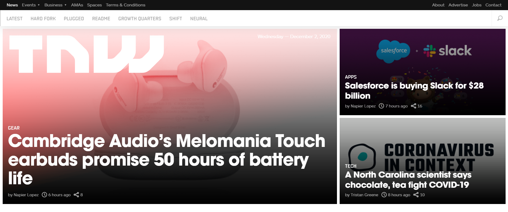

# Building with Responsive Design - TNW-Clone

> The next web website clone.

Working with media queries to make websites more accessible in a responsive way. taking care of all the kinds of devices the website would be assessed .

## Built With

- Major languages -- HTML and CSS
- Frameworks --None
- Technologies used -- Basic

## Live Demo

[Live Demo Link](https://chrystalme.github.io/tnw-responsive-project/)

## Authors

👤 **Author1**

- GitHub: [@githubhandle](https://github.com/chrystalme)
- Twitter [@twitterhandle](@afam_chrys)

